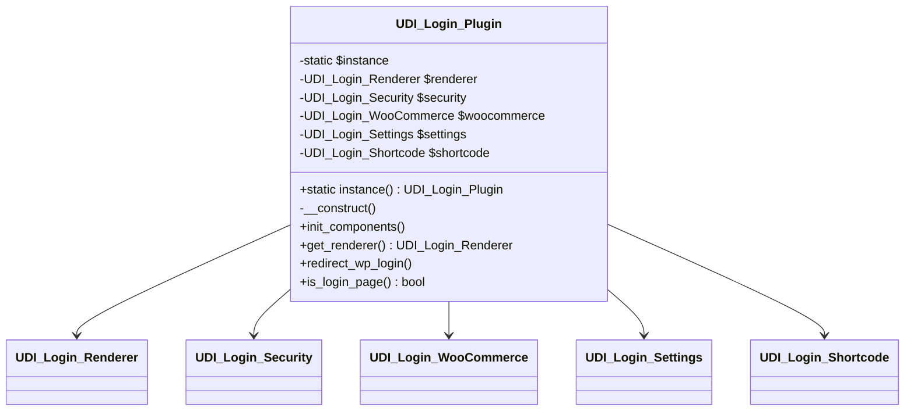
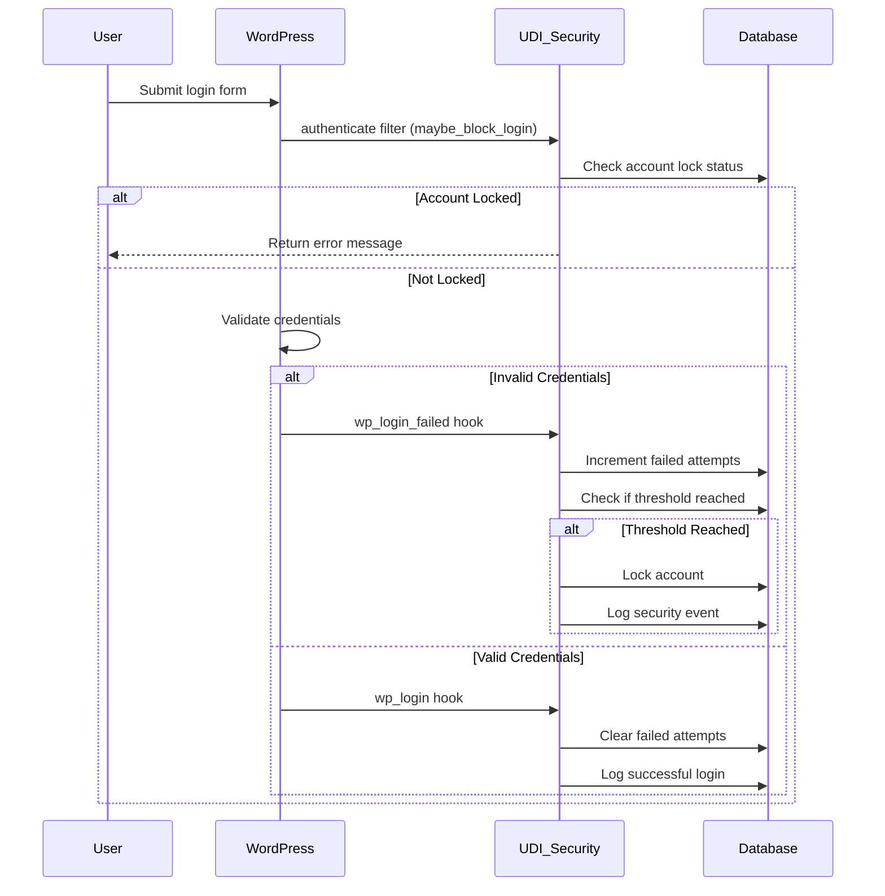
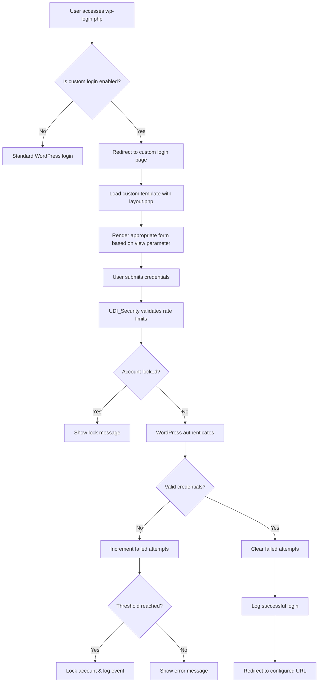
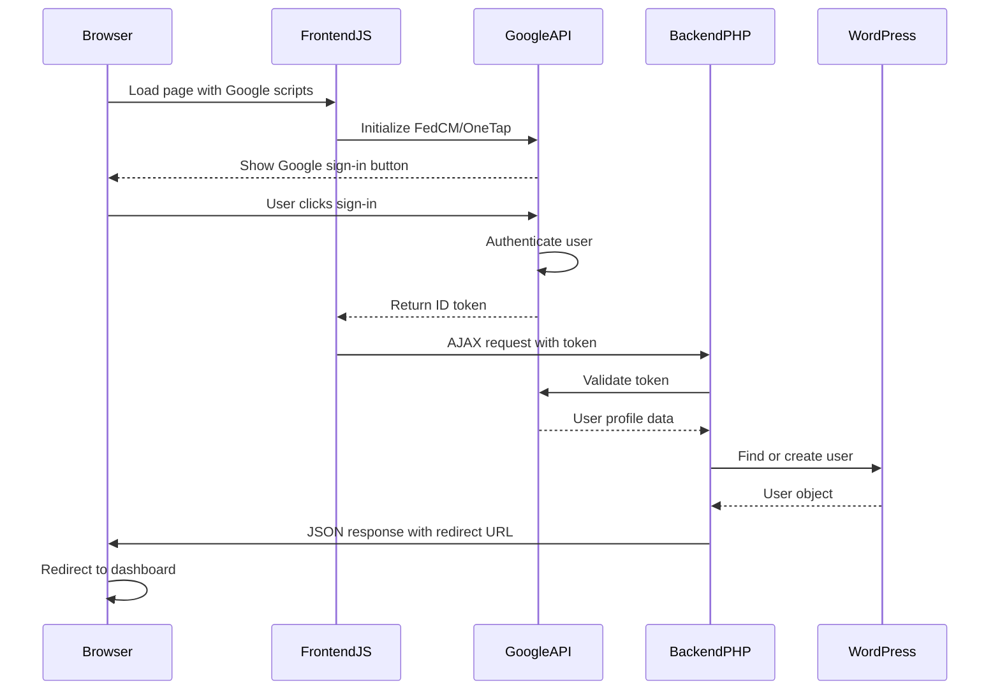
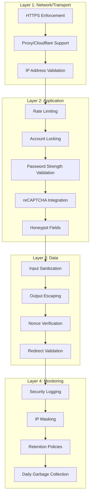

# TriqHub: Custom Login – Architecture Documentation

## 1. Overview

**TriqHub: Custom Login** is a WordPress plugin that completely replaces all WordPress/WooCommerce authentication screens with a custom-designed neon dark experience. It provides enhanced security, advanced configuration options, and seamless integration with modern authentication methods including Google Sign-In with FedCM support.

### Core Capabilities
- Complete replacement of `wp-login.php` with custom templates
- WooCommerce My Account page styling and customization
- Advanced security features (rate limiting, password strength validation, security logging)
- Google Sign-In integration with modern FedCM API
- Customizable redirects and messaging
- Database-backed security logging with retention policies
- Automatic updates via GitHub integration

## 2. Directory Structure

```
triqhub-custom-login/
├── triqhub-custom-login.php          # Main plugin file
├── includes/
│   ├── core/
│   │   └── class-triqhub-connector.php  # TriqHub invisible connector
│   ├── class-udi-login-plugin.php       # Main plugin controller
│   ├── class-udi-login-installer.php    # Database installer
│   ├── class-udi-login-renderer.php     # Template renderer
│   ├── class-udi-login-shortcode.php    # [udi_custom_login] shortcode
│   ├── class-udi-login-settings.php     # Settings page controller
│   ├── class-udi-login-security.php     # Security features
│   ├── class-udi-login-woocommerce.php  # WooCommerce integration
│   ├── helpers.php                      # Utility functions
│   └── security-helpers.php             # Security-specific utilities
├── templates/
│   ├── layout.php                       # Main login layout
│   ├── page-login.php                   # Dedicated login page template
│   └── woocommerce/
│       └── form-login.php               # WooCommerce login override
├── assets/
│   ├── css/
│   │   ├── triqhub-admin.css           # Admin styling
│   │   └── frontend.css                # Frontend styling
│   └── js/
│       └── frontend.js                  # Frontend JavaScript
├── languages/                           # Translation files
├── vendor/                             # Composer dependencies
└── README.md
```

## 3. Database Schema

### 3.1 Security Logs Table (`wp_udi_security_logs`)

Created during plugin activation via `UDI_Login_Installer`.

```sql
CREATE TABLE `wp_udi_security_logs` (
  `id` bigint(20) UNSIGNED NOT NULL AUTO_INCREMENT,
  `event_type` varchar(50) NOT NULL,
  `message` varchar(255) NOT NULL,
  `ip_address` varchar(45) NOT NULL,
  `ip_hash` varchar(64) NOT NULL,
  `user_id` bigint(20) UNSIGNED DEFAULT 0,
  `meta_json` longtext,
  `created_at` datetime NOT NULL,
  PRIMARY KEY (`id`),
  KEY `event_type` (`event_type`),
  KEY `ip_hash` (`ip_hash`),
  KEY `user_id` (`user_id`),
  KEY `created_at` (`created_at`)
) ENGINE=InnoDB DEFAULT CHARSET=utf8mb4 COLLATE=utf8mb4_unicode_ci;
```

### 3.2 User Meta Extensions

- `_udi_account_locked_until` (bigint): Timestamp when account lock expires
- `_udi_login_attempts` (int): Failed login attempts count (transient storage)

### 3.3 WordPress Options

- `udi_login_settings`: Serialized array of all plugin settings
- `udi_login_security_logs`: Legacy log storage (fallback)

## 4. Key Classes & Components

### 4.1 Core Plugin Controller (`UDI_Login_Plugin`)

**Singleton Pattern** – Ensures single instance throughout WordPress lifecycle.



**Responsibilities:**
- Initializes all sub-components
- Manages WordPress hooks for login redirection
- Coordinates between different modules
- Provides access to renderer and other services

### 4.2 Template Renderer (`UDI_Login_Renderer`)

**Strategy Pattern** – Different rendering strategies for different views (login, register, lost password).

```php
class UDI_Login_Renderer {
    public function render($view, $data = array()) {
        // Determines which template to use based on view
        // Applies filters and actions
        // Returns HTML output
    }
    
    public function get_form_html($view) {
        // Returns form HTML for specific view
        // Includes security tokens and validation
    }
}
```

**View States:**
- `login`: Default login form
- `register`: Registration form (if enabled)
- `lostpassword`: Password recovery
- `resetpass`: Password reset

### 4.3 Security Controller (`UDI_Login_Security`)

**Observer Pattern** – Monitors authentication events and applies security policies.



**Security Features:**
- Rate limiting with configurable thresholds
- Account locking with time-based expiration
- HTTPS enforcement for login pages
- Generic error messages to prevent username enumeration
- IP address masking for privacy

### 4.4 Settings Manager (`UDI_Login_Settings`)

**Builder Pattern** – Constructs complex settings interface with multiple sections.

```php
class UDI_Login_Settings {
    const OPTION = 'udi_login_settings';
    
    public function register_settings() {
        // Registers 5 main sections:
        // 1. General Settings
        // 2. Messaging
        // 3. Security
        // 4. Google Sign-In
        // 5. Redirects
        // 6. WooCommerce My Account
    }
    
    public function sanitize($input) {
        // Type-safe sanitization for each field type
        // Boolean, integer, text, URL validation
    }
}
```

### 4.5 TriqHub Connector (`TriqHub_Connector`)

**Facade Pattern** – Provides simplified interface to TriqHub services.

```php
class TriqHub_Connector {
    public function __construct($api_key, $plugin_slug) {
        // Establishes connection to TriqHub API
        // Registers plugin for updates and analytics
        // Runs in background without user interaction
    }
}
```

## 5. Authentication Flow

### 5.1 Custom Login Flow



### 5.2 Google Sign-In Flow (FedCM)



## 6. Design Patterns Implemented

### 6.1 Singleton Pattern
- `UDI_Login_Plugin::instance()` ensures single instance
- Prevents multiple initializations and memory waste

### 6.2 Factory Pattern
- `UDI_Login_Renderer` creates appropriate form HTML based on view type
- `PucFactory` from Plugin Update Checker creates update checker instance

### 6.3 Observer Pattern
- Security module observes `wp_login_failed`, `wp_login`, `authenticate` hooks
- Logs events and applies policies reactively

### 6.4 Strategy Pattern
- Different rendering strategies for login, register, lost password views
- Different validation strategies for password strength

### 6.5 Facade Pattern
- `TriqHub_Connector` simplifies complex API interactions
- `udi_login_get_option()` provides simple interface to nested settings

## 7. Security Architecture

### 7.1 Defense in Depth



### 7.2 Privacy by Design

1. **IP Address Masking**: Last octet masked for IPv4, partial masking for IPv6
2. **IP Hashing**: HMAC-SHA256 hashed IPs for aggregation without storing raw IPs
3. **Data Retention**: Automatic deletion of logs older than 30 days
4. **Minimal Data Collection**: Only essential security events logged

## 8. Integration Points

### 8.1 WordPress Core Hooks

```php
// Authentication
add_filter('authenticate', [$this, 'maybe_block_login'], 30, 3);
add_action('wp_login_failed', [$this, 'record_failed_login']);
add_action('wp_login', [$this, 'clear_login_attempts']);

// Template Loading
add_filter('login_redirect', [$this, 'custom_login_redirect'], 10, 3);
add_action('login_form_login', [$this, 'maybe_redirect_to_custom']);
add_action('login_form_register', [$this, 'maybe_redirect_to_custom']);

// Admin Interface
add_action('admin_menu', [$this, 'register_menu']);
add_action('admin_init', [$this, 'register_settings']);
```

### 8.2 WooCommerce Integration

```php
// Template Override
add_filter('woocommerce_locate_template', [$this, 'override_login_template'], 10, 3);

// My Account Customization
add_filter('woocommerce_account_menu_items', [$this, 'customize_account_menu']);
add_action('woocommerce_account_history_endpoint', [$this, 'history_endpoint_content']);
```

### 8.3 Google Sign-In Integration

```php
// Frontend Scripts
add_action('wp_enqueue_scripts', [$this, 'enqueue_google_signin_scripts']);

// AJAX Handlers
add_action('wp_ajax_udi_google_signin', [$this, 'handle_google_signin']);
add_action('wp_ajax_nopriv_udi_google_signin', [$this, 'handle_google_signin']);
```

## 9. Error Handling & Logging

### 9.1 Multi-tier Logging System

```php
// 1. Security Events (Database)
udi_login_log_security_event('login_failed', 'Invalid credentials', $context);

// 2. Critical Events (Error Log)
error_log('[UDI Login Security] Account locked for IP: ' . $ip_hash);

// 3. User-facing Messages
$messages[] = [
    'type' => 'error',
    'message' => __('Credenciais inválidas.', 'udi-custom-login')
];

// 4. Admin Notifications (Future)
do_action('udi_login_admin_alert', $event_type, $details);
```

### 9.2 Graceful Degradation

1. **Database Table Missing**: Falls back to option-based logging
2. **reCAPTCHA Unavailable**: Shows form without CAPTCHA
3. **Google API Unreachable**: Hides Google Sign-In button
4. **WooCommerce Not Active**: Disables WooCommerce-specific features

## 10. Performance Considerations

### 10.1 Caching Strategy
- Settings cached in WordPress object cache after first load
- Database queries optimized with proper indexes
- Static assets versioned for cache busting

### 10.2 Lazy Loading
- Google Sign-In scripts loaded only when enabled
- reCAPTCHA loaded only on forms requiring it
- Background processes scheduled for low-traffic periods

### 10.3 Database Optimization
- Security logs table indexed on `event_type`, `ip_hash`, `created_at`
- Daily garbage collection prevents table bloat
- Batch operations for log cleanup

## 11. Extension Points

### 11.1 Action Hooks
```php
do_action('udi_login_intro', $view, $settings);
do_action('udi_login_after_card', $view, $settings);
do_action('udi_login_security_event_logged', $event_type, $message, $context);
```

### 11.2 Filter Hooks
```php
apply_filters('udi_login_settings_defaults', $defaults);
apply_filters('udi_login_form_html', $html, $view);
apply_filters('udi_login_redirect_url', $url, $context);
```

### 11.3 Custom Template Overrides
- Child themes can override `templates/layout.php`
- Custom CSS via `udi-login-custom` handle
- JavaScript extensions via `udi_login_js_data` filter

## 12. Update Mechanism

### 12.1 GitHub Integration
```php
$myUpdateChecker = PucFactory::buildUpdateChecker(
    'https://github.com/gustavofullstack/triqhub-custom-login',
    __FILE__,
    'triqhub-custom-login'
);
```

### 12.2 Update Flow
1. Plugin checks GitHub for new tags on `main` branch
2. If update available, shows notification in WordPress admin
3. User clicks update, plugin downloads and installs from GitHub
4. For private repos, uses `UDI_LOGIN_GITHUB_TOKEN` for authentication

## 13. Internationalization

### 13.1 Translation Ready
- All user-facing text wrapped in `__()`, `_e()`, `esc_html__()` functions
- Text domain: `udi-custom-login`
- Domain path: `/languages`
- POT file generated for translators

### 13.2 RTL Support
- CSS includes `rtl` prefix for right-to-left languages
- Layout uses flexbox for directional flexibility

---

## Conclusion

The TriqHub Custom Login plugin demonstrates enterprise-grade WordPress plugin architecture with:
- **Modular design** allowing easy maintenance and extension
- **Security-first approach** with multiple defensive layers
- **Modern authentication** supporting both traditional and social login
- **Scalable architecture** suitable for high-traffic sites
- **